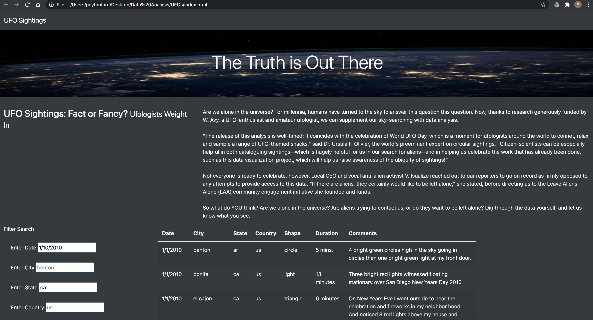

# UFOs, Oh Boy!
## Overview
### Purpose
Dana, a data journalist, wants to put together a website to store the sightings of UFOs all over the world. She wanted to have a website that would allow for people to filter multiple criteria to be able to look at the details of the UFO sightings. The criteria that is abled to be filtered is the date, city, state, country, and the shape of the UFO sighting.
## Results

As you can see, there are many ways to filter the data to find what you are looking for. The only way to filter the data is to use one of the five search filters. 
For example, if we wanted to see all the UFO sightings in CA, we would able to see every sighting in California. To clear the search filter, you can press the "UFO Sightings" at the top left and then you can search a different filter once more!

## Summary
For future development, I think we should have the ability to search for multiple things at the same time. That is the drawback of this website. You can only search for one thing at a time. For example, if I wanted to search for sightings in California on 1/10/2010, I wouldn't be able to. Another reccommendation for future development is having a "Clear Search" button instead of the "UFO Sightings" in the top left. It makes it more user friendly and has a clear distinction of what that function does.
